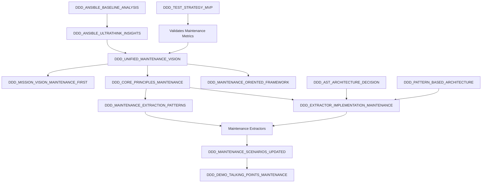

# DDD Memory Interconnection Map
Created: 2025-09-05
Purpose: Link all memories into a cohesive knowledge graph for the maintenance-first framework

## Memory Architecture Overview

```
┌─────────────────────────────────────────┐
│   UNIFIED MAINTENANCE VISION (Core)     │
│   └── Links all strategic memories      │
└─────────────────────────────────────────┘
                    ↓
    ┌───────────────┼───────────────┐
    ↓               ↓               ↓
PRINCIPLES    IMPLEMENTATION    SCENARIOS
    ↓               ↓               ↓
EVIDENCE      EXTRACTION      DEMONSTRATION
```

## Core Vision Memories (Strategic Layer)

### 🎯 DDD_UNIFIED_MAINTENANCE_VISION (Master Document)
**Links to**:
- → DDD_MISSION_VISION_MAINTENANCE_FIRST (refined mission)
- → DDD_CORE_PRINCIPLES_MAINTENANCE (operational principles)
- → DDD_MAINTENANCE_ORIENTED_FRAMEWORK (strategic framework)
- → DDD_DEMO_TALKING_POINTS_MAINTENANCE (communication strategy)

**Referenced by**:
- ← All implementation memories for strategic alignment
- ← All test strategies for success metrics

### 📋 DDD_MISSION_VISION_MAINTENANCE_FIRST
**Extends**: DDD_MISSION_AND_VISION (original vision)
**Implements**: The four pillars from DDD_CORE_PRINCIPLES_MAINTENANCE
**Validates through**: DDD_ANSIBLE_BASELINE_ANALYSIS (96% docs, 32% maintainable)
**Demonstrates via**: DDD_DEMO_TALKING_POINTS_MAINTENANCE

### 🏗️ DDD_CORE_PRINCIPLES_MAINTENANCE
**Replaces**: DDD_CORE_PRINCIPLES (coverage focus)
**Drives**:
- → DDD_MAINTENANCE_EXTRACTION_PATTERNS (what to extract)
- → DDD_EXTRACTOR_IMPLEMENTATION_MAINTENANCE (how to extract)
- → DDD_MAINTENANCE_SCENARIOS_UPDATED (what to generate)

## Evidence and Analysis Memories (Validation Layer)

### 🔍 DDD_ANSIBLE_BASELINE_ANALYSIS
**Validates**: The maintenance-first hypothesis
**Proves**: 96% coverage ≠ maintainability
**Links to**:
- → DDD_ANSIBLE_ULTRATHINK_INSIGHTS (deep analysis)
- → DDD_ANSIBLE_PATTERNS_CRITICAL (pattern discoveries)
- → DDD_MAINTENANCE_SCENARIOS_UPDATED (real-world needs)

### 🧠 DDD_ANSIBLE_ULTRATHINK_INSIGHTS
**Discovered**: The "2AM Score" → evolved to Daily Ops Score
**Revealed**: Shadow architecture (what's missing)
**Informs**:
- → DDD_MAINTENANCE_EXTRACTION_PATTERNS (negative space patterns)
- → DDD_UNIFIED_MAINTENANCE_VISION (paradigm shift)

## Implementation Memories (Technical Layer)

### ⚙️ DDD_EXTRACTOR_IMPLEMENTATION_MAINTENANCE
**Implements**: Vision from DDD_UNIFIED_MAINTENANCE_VISION
**Replaces**: DDD_EXTRACTOR_IMPLEMENTATION_GUIDE (API focus)
**Uses**:
- → DDD_AST_ARCHITECTURE_DECISION (AST over regex)
- → DDD_MAINTENANCE_EXTRACTION_PATTERNS (pattern library)
- → DDD_PATTERN_BASED_ARCHITECTURE (plugin system)

**Produces**: Maintenance readiness scores for DDD_MAINTENANCE_ORIENTED_FRAMEWORK

### 🔧 DDD_MAINTENANCE_EXTRACTION_PATTERNS
**Technical spec for**: DDD_EXTRACTOR_IMPLEMENTATION_MAINTENANCE
**Derived from**: DDD_ANSIBLE_PATTERNS_CRITICAL
**Implements principles from**: DDD_CORE_PRINCIPLES_MAINTENANCE
**Generates content for**: DDD_MAINTENANCE_SCENARIOS_UPDATED

### 🏛️ DDD_COMPLETE_EXTRACTOR_ARCHITECTURE
**Extended by**: DDD_EXTRACTOR_IMPLEMENTATION_MAINTENANCE
**Now includes**:
- DailyMaintenanceExtractor (new)
- WeeklyMaintenanceExtractor (new)
- MonthlyMaintenanceExtractor (new)
- Traditional extractors (updated with maintenance focus)

## Scenario and Use Case Memories

### 📚 DDD_MAINTENANCE_SCENARIOS_UPDATED
**Replaces**: DDD_MAINTENANCE_SCENARIOS (crisis focus)
**Implements**: Daily/Weekly/Monthly from DDD_MAINTENANCE_ORIENTED_FRAMEWORK
**Uses patterns from**: DDD_MAINTENANCE_EXTRACTION_PATTERNS
**Validates metrics in**: DDD_UNIFIED_MAINTENANCE_VISION

### 🎤 DDD_DEMO_TALKING_POINTS_MAINTENANCE
**Replaces**: DDD_DEMO_TALKING_POINTS (coverage focus)
**Demonstrates**:
- Metrics from DDD_UNIFIED_MAINTENANCE_VISION
- Scenarios from DDD_MAINTENANCE_SCENARIOS_UPDATED
- Evidence from DDD_ANSIBLE_BASELINE_ANALYSIS
**Uses**: DDD_SPHINX_CONFIG_IMPROVEMENTS for demo environment

## Testing and Quality Memories

### 🧪 DDD_TEST_STRATEGY_MVP
**Now validates**: Maintenance readiness, not just coverage
**Links to**:
- → DDD_MVP_TEST_SUITE_COMPREHENSIVE (test implementation)
- → DDD_TEST_SUITE_GAP_ANALYSIS (maintenance gaps)
**Measures success per**: DDD_UNIFIED_MAINTENANCE_VISION metrics

### ✅ DDD_TDD_IMPLEMENTATION_SESSION
**Demonstrates**: RED-GREEN-REFACTOR for maintenance docs
**Links through**:
- → DDD_TDD_RED_PHASE_COMPLETE (requirements)
- → DDD_TDD_GREEN_PHASE_COMPLETE (implementation)
- → DDD_REFACTOR_PHASE_COMPLETE (optimization)
**Now focuses on**: Maintenance scenario testing

## Architecture Decision Records

### 🌳 DDD_AST_ARCHITECTURE_DECISION
**Critical for**: DDD_MAINTENANCE_EXTRACTION_PATTERNS
**Enables**: Reliable extraction of maintenance patterns
**Used by**: All extractor implementations

### 🔌 DDD_PATTERN_BASED_ARCHITECTURE
**Enables**: Pluggable maintenance extractors
**Supports**: DDD_EXTRACTOR_IMPLEMENTATION_MAINTENANCE
**Allows**: Domain-specific maintenance patterns

## Current State and Progress

### 📊 DDD_CURRENT_STATE
**Now tracks**:
- Maintenance readiness implementation progress
- Links to all updated memories
- References DDD_UNIFIED_MAINTENANCE_VISION for goals

### 📇 DDD_PROJECT_INDEX
**Updated to reference**:
- New maintenance-focused memories
- Revised architecture with maintenance extractors
- New success metrics from MMM (Maintenance Maturity Model)

## Memory Dependency Graph



## Cross-References and Relationships

### Supersession Chain (Old → New)
1. DDD_MISSION_AND_VISION → DDD_MISSION_VISION_MAINTENANCE_FIRST
2. DDD_CORE_PRINCIPLES → DDD_CORE_PRINCIPLES_MAINTENANCE
3. DDD_EXTRACTOR_IMPLEMENTATION_GUIDE → DDD_EXTRACTOR_IMPLEMENTATION_MAINTENANCE
4. DDD_MAINTENANCE_SCENARIOS → DDD_MAINTENANCE_SCENARIOS_UPDATED
5. DDD_DEMO_TALKING_POINTS → DDD_DEMO_TALKING_POINTS_MAINTENANCE

### Evidence Chain (Proof → Conclusion)
1. DDD_ANSIBLE_BASELINE_ANALYSIS (96% docs, 32% maintainable)
2. → DDD_ANSIBLE_ULTRATHINK_INSIGHTS (shadow architecture)
3. → DDD_UNIFIED_MAINTENANCE_VISION (paradigm shift needed)
4. → DDD_CORE_PRINCIPLES_MAINTENANCE (new approach)

### Implementation Chain (Vision → Reality)
1. DDD_UNIFIED_MAINTENANCE_VISION (what we want)
2. → DDD_MAINTENANCE_EXTRACTION_PATTERNS (what to look for)
3. → DDD_EXTRACTOR_IMPLEMENTATION_MAINTENANCE (how to extract)
4. → DDD_MAINTENANCE_SCENARIOS_UPDATED (what to generate)
5. → DDD_DEMO_TALKING_POINTS_MAINTENANCE (how to prove value)

## Memory Access Patterns

### For Understanding the Vision
Start with:
1. DDD_UNIFIED_MAINTENANCE_VISION
2. Then read DDD_ANSIBLE_BASELINE_ANALYSIS for evidence
3. Review DDD_CORE_PRINCIPLES_MAINTENANCE for approach

### for Implementation
Start with:
1. DDD_MAINTENANCE_EXTRACTION_PATTERNS
2. Reference DDD_EXTRACTOR_IMPLEMENTATION_MAINTENANCE
3. Use DDD_AST_ARCHITECTURE_DECISION for technical approach

### For Communication
Start with:
1. DDD_DEMO_TALKING_POINTS_MAINTENANCE
2. Reference DDD_MAINTENANCE_SCENARIOS_UPDATED for examples
3. Use metrics from DDD_UNIFIED_MAINTENANCE_VISION

## Quick Memory Lookup Guide

| Need | Primary Memory | Supporting Memories |
|------|---------------|-------------------|
| Overall vision | DDD_UNIFIED_MAINTENANCE_VISION | MISSION, PRINCIPLES |
| Technical implementation | DDD_EXTRACTOR_IMPLEMENTATION_MAINTENANCE | PATTERNS, AST |
| Evidence/Validation | DDD_ANSIBLE_BASELINE_ANALYSIS | ULTRATHINK, PATTERNS |
| Scenarios/Examples | DDD_MAINTENANCE_SCENARIOS_UPDATED | EXTRACTION_PATTERNS |
| Demo/Presentation | DDD_DEMO_TALKING_POINTS_MAINTENANCE | SCENARIOS, UNIFIED |
| Current progress | DDD_CURRENT_STATE | PROJECT_INDEX |

## Memory Integrity Checks

All memories now align on:
- ✅ Maintenance-first focus (not coverage)
- ✅ Daily/Weekly/Monthly framework (not 2AM)
- ✅ Junior engineer enablement (key metric)
- ✅ Predictable operations (boring is good)
- ✅ 4 pillars (predictable, error-free, escalation, compliance)

This interconnection ensures consistent understanding and implementation across all aspects of the DDD framework.