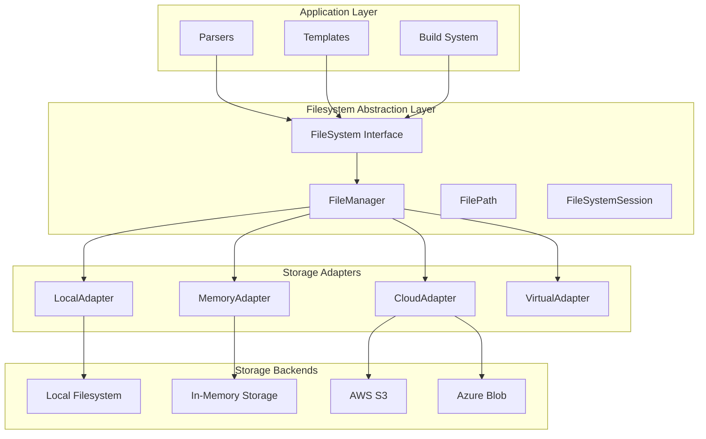

# Filesystem Abstraction Layer Design
## Infrastructure Documentation Standards Project

**Version**: 1.0.0  
**Date**: 2025-08-27  
**Status**: Architectural Design Specification  
**Type**: Component Architecture

---

## 1. Executive Summary

This document specifies a comprehensive filesystem abstraction layer to decouple the Infrastructure Documentation Standards project from direct file I/O operations. This abstraction will improve testability, enable multiple storage backends, and provide a consistent interface for all file operations across parsers and components.

### Key Benefits
- **Testability**: 100% mockable filesystem operations
- **Flexibility**: Support for multiple storage backends (local, cloud, memory)
- **Consistency**: Unified error handling and logging
- **Security**: Centralized access control and validation
- **Performance**: Built-in caching and optimization capabilities

---

## 2. Architecture Overview

### 2.1 Layered Architecture



### 2.2 Design Patterns

1. **Adapter Pattern**: Multiple storage backend implementations
2. **Factory Pattern**: Storage adapter creation based on configuration
3. **Strategy Pattern**: Interchangeable storage strategies
4. **Repository Pattern**: Abstracted data access operations
5. **Chain of Responsibility**: Layered error handling and validation

---

## 3. Core Components

### 3.1 FileSystem Interface (Abstract Base)

```python
# automation/filesystem/base.py
from abc import ABC, abstractmethod
from pathlib import Path
from typing import List, Optional, Union, Iterator, BinaryIO, TextIO
from datetime import datetime
from dataclasses import dataclass
import enum

class FileType(enum.Enum):
    """File type enumeration for type-safe operations."""
    FILE = "file"
    DIRECTORY = "directory"
    SYMLINK = "symlink"
    UNKNOWN = "unknown"

class FilePermission(enum.Enum):
    """File permission levels."""
    READ = "read"
    WRITE = "write"
    EXECUTE = "execute"
    
@dataclass
class FileMetadata:
    """Metadata for filesystem entries."""
    path: Path
    type: FileType
    size: int
    created: datetime
    modified: datetime
    accessed: datetime
    permissions: List[FilePermission]
    owner: Optional[str] = None
    mime_type: Optional[str] = None
    encoding: Optional[str] = 'utf-8'
    
@dataclass
class FileSystemConfig:
    """Configuration for filesystem operations."""
    root_path: Path
    read_only: bool = False
    cache_enabled: bool = True
    cache_ttl: int = 300  # seconds
    max_file_size: int = 100 * 1024 * 1024  # 100MB
    allowed_extensions: Optional[List[str]] = None
    denied_extensions: Optional[List[str]] = None
    enable_audit: bool = True
    enable_encryption: bool = False

class FileSystemError(Exception):
    """Base exception for filesystem operations."""
    pass

class FileNotFoundError(FileSystemError):
    """File or directory not found."""
    pass

class PermissionError(FileSystemError):
    """Insufficient permissions for operation."""
    pass

class StorageError(FileSystemError):
    """Storage backend error."""
    pass

class FileSystem(ABC):
    """Abstract base class for filesystem operations."""
    
    def __init__(self, config: FileSystemConfig):
        self.config = config
        self._cache = {} if config.cache_enabled else None
        
    # Core Operations
    @abstractmethod
    def exists(self, path: Union[str, Path]) -> bool:
        """Check if path exists."""
        pass
    
    @abstractmethod
    def is_file(self, path: Union[str, Path]) -> bool:
        """Check if path is a file."""
        pass
    
    @abstractmethod
    def is_directory(self, path: Union[str, Path]) -> bool:
        """Check if path is a directory."""
        pass
    
    @abstractmethod
    def read_text(self, path: Union[str, Path], encoding: str = 'utf-8') -> str:
        """Read text content from file."""
        pass
    
    @abstractmethod
    def read_bytes(self, path: Union[str, Path]) -> bytes:
        """Read binary content from file."""
        pass
    
    @abstractmethod
    def write_text(self, path: Union[str, Path], content: str, 
                   encoding: str = 'utf-8', create_dirs: bool = True) -> None:
        """Write text content to file."""
        pass
    
    @abstractmethod
    def write_bytes(self, path: Union[str, Path], content: bytes, 
                    create_dirs: bool = True) -> None:
        """Write binary content to file."""
        pass
    
    @abstractmethod
    def delete(self, path: Union[str, Path], recursive: bool = False) -> None:
        """Delete file or directory."""
        pass
    
    @abstractmethod
    def create_directory(self, path: Union[str, Path], 
                        parents: bool = True, exist_ok: bool = True) -> None:
        """Create directory."""
        pass
    
    @abstractmethod
    def list_directory(self, path: Union[str, Path], 
                      recursive: bool = False) -> List[Path]:
        """List directory contents."""
        pass
    
    @abstractmethod
    def glob(self, pattern: str, root: Optional[Union[str, Path]] = None) -> List[Path]:
        """Find files matching glob pattern."""
        pass
    
    @abstractmethod
    def copy(self, source: Union[str, Path], 
             destination: Union[str, Path], overwrite: bool = False) -> None:
        """Copy file or directory."""
        pass
    
    @abstractmethod
    def move(self, source: Union[str, Path], 
             destination: Union[str, Path], overwrite: bool = False) -> None:
        """Move file or directory."""
        pass
    
    @abstractmethod
    def get_metadata(self, path: Union[str, Path]) -> FileMetadata:
        """Get file metadata."""
        pass
    
    # Stream Operations
    @abstractmethod
    def open_text(self, path: Union[str, Path], mode: str = 'r', 
                  encoding: str = 'utf-8') -> TextIO:
        """Open text file for streaming."""
        pass
    
    @abstractmethod
    def open_binary(self, path: Union[str, Path], mode: str = 'rb') -> BinaryIO:
        """Open binary file for streaming."""
        pass
    
    # Utility Methods
    def resolve_path(self, path: Union[str, Path]) -> Path:
        """Resolve path relative to root."""
        path = Path(path)
        if not path.is_absolute():
            path = self.config.root_path / path
        return path.resolve()
    
    def validate_path(self, path: Path) -> None:
        """Validate path against security rules."""
        # Ensure path is within root
        try:
            path.relative_to(self.config.root_path)
        except ValueError:
            raise PermissionError(f"Path {path} is outside root directory")
        
        # Check extension restrictions
        if self.config.allowed_extensions:
            if path.suffix not in self.config.allowed_extensions:
                raise PermissionError(f"File extension {path.suffix} not allowed")
        
        if self.config.denied_extensions:
            if path.suffix in self.config.denied_extensions:
                raise PermissionError(f"File extension {path.suffix} is denied")
```

### 3.2 Local Filesystem Adapter

```python
# automation/filesystem/adapters/local.py
import os
import shutil
from pathlib import Path
from typing import List, Optional, Union, TextIO, BinaryIO
from datetime import datetime
from ..base import FileSystem, FileMetadata, FileType, FilePermission

class LocalFileSystemAdapter(FileSystem):
    """Local filesystem implementation."""
    
    def exists(self, path: Union[str, Path]) -> bool:
        """Check if path exists."""
        path = self.resolve_path(path)
        return path.exists()
    
    def is_file(self, path: Union[str, Path]) -> bool:
        """Check if path is a file."""
        path = self.resolve_path(path)
        return path.is_file()
    
    def is_directory(self, path: Union[str, Path]) -> bool:
        """Check if path is a directory."""
        path = self.resolve_path(path)
        return path.is_dir()
    
    def read_text(self, path: Union[str, Path], encoding: str = 'utf-8') -> str:
        """Read text content from file."""
        if self.config.read_only:
            self._check_cache(path)
        
        path = self.resolve_path(path)
        self.validate_path(path)
        
        if not path.exists():
            raise FileNotFoundError(f"File not found: {path}")
        
        try:
            with open(path, 'r', encoding=encoding) as f:
                content = f.read()
            
            if self.config.cache_enabled:
                self._update_cache(path, content)
            
            return content
        except Exception as e:
            raise StorageError(f"Error reading file {path}: {e}")
    
    def read_bytes(self, path: Union[str, Path]) -> bytes:
        """Read binary content from file."""
        path = self.resolve_path(path)
        self.validate_path(path)
        
        if not path.exists():
            raise FileNotFoundError(f"File not found: {path}")
        
        try:
            with open(path, 'rb') as f:
                return f.read()
        except Exception as e:
            raise StorageError(f"Error reading file {path}: {e}")
    
    def write_text(self, path: Union[str, Path], content: str, 
                   encoding: str = 'utf-8', create_dirs: bool = True) -> None:
        """Write text content to file."""
        if self.config.read_only:
            raise PermissionError("Filesystem is read-only")
        
        path = self.resolve_path(path)
        self.validate_path(path)
        
        if create_dirs:
            path.parent.mkdir(parents=True, exist_ok=True)
        
        try:
            with open(path, 'w', encoding=encoding) as f:
                f.write(content)
            
            if self.config.cache_enabled:
                self._invalidate_cache(path)
                
        except Exception as e:
            raise StorageError(f"Error writing file {path}: {e}")
    
    def write_bytes(self, path: Union[str, Path], content: bytes, 
                    create_dirs: bool = True) -> None:
        """Write binary content to file."""
        if self.config.read_only:
            raise PermissionError("Filesystem is read-only")
        
        path = self.resolve_path(path)
        self.validate_path(path)
        
        if create_dirs:
            path.parent.mkdir(parents=True, exist_ok=True)
        
        try:
            with open(path, 'wb') as f:
                f.write(content)
            
            if self.config.cache_enabled:
                self._invalidate_cache(path)
                
        except Exception as e:
            raise StorageError(f"Error writing file {path}: {e}")
    
    def delete(self, path: Union[str, Path], recursive: bool = False) -> None:
        """Delete file or directory."""
        if self.config.read_only:
            raise PermissionError("Filesystem is read-only")
        
        path = self.resolve_path(path)
        self.validate_path(path)
        
        if not path.exists():
            return
        
        try:
            if path.is_file():
                path.unlink()
            elif path.is_dir():
                if recursive:
                    shutil.rmtree(path)
                else:
                    path.rmdir()
            
            if self.config.cache_enabled:
                self._invalidate_cache(path)
                
        except Exception as e:
            raise StorageError(f"Error deleting {path}: {e}")
    
    def create_directory(self, path: Union[str, Path], 
                        parents: bool = True, exist_ok: bool = True) -> None:
        """Create directory."""
        if self.config.read_only:
            raise PermissionError("Filesystem is read-only")
        
        path = self.resolve_path(path)
        self.validate_path(path)
        
        try:
            path.mkdir(parents=parents, exist_ok=exist_ok)
        except Exception as e:
            raise StorageError(f"Error creating directory {path}: {e}")
    
    def list_directory(self, path: Union[str, Path], 
                      recursive: bool = False) -> List[Path]:
        """List directory contents."""
        path = self.resolve_path(path)
        self.validate_path(path)
        
        if not path.is_dir():
            raise FileNotFoundError(f"Directory not found: {path}")
        
        try:
            if recursive:
                return list(path.rglob("*"))
            else:
                return list(path.iterdir())
        except Exception as e:
            raise StorageError(f"Error listing directory {path}: {e}")
    
    def glob(self, pattern: str, root: Optional[Union[str, Path]] = None) -> List[Path]:
        """Find files matching glob pattern."""
        root = self.resolve_path(root or self.config.root_path)
        
        try:
            return list(root.glob(pattern))
        except Exception as e:
            raise StorageError(f"Error globbing pattern {pattern}: {e}")
    
    def copy(self, source: Union[str, Path], 
             destination: Union[str, Path], overwrite: bool = False) -> None:
        """Copy file or directory."""
        if self.config.read_only:
            raise PermissionError("Filesystem is read-only")
        
        source = self.resolve_path(source)
        destination = self.resolve_path(destination)
        self.validate_path(source)
        self.validate_path(destination)
        
        if not overwrite and destination.exists():
            raise FileExistsError(f"Destination already exists: {destination}")
        
        try:
            if source.is_file():
                shutil.copy2(source, destination)
            else:
                shutil.copytree(source, destination, dirs_exist_ok=overwrite)
            
            if self.config.cache_enabled:
                self._invalidate_cache(destination)
                
        except Exception as e:
            raise StorageError(f"Error copying {source} to {destination}: {e}")
    
    def move(self, source: Union[str, Path], 
             destination: Union[str, Path], overwrite: bool = False) -> None:
        """Move file or directory."""
        if self.config.read_only:
            raise PermissionError("Filesystem is read-only")
        
        source = self.resolve_path(source)
        destination = self.resolve_path(destination)
        self.validate_path(source)
        self.validate_path(destination)
        
        if not overwrite and destination.exists():
            raise FileExistsError(f"Destination already exists: {destination}")
        
        try:
            shutil.move(str(source), str(destination))
            
            if self.config.cache_enabled:
                self._invalidate_cache(source)
                self._invalidate_cache(destination)
                
        except Exception as e:
            raise StorageError(f"Error moving {source} to {destination}: {e}")
    
    def get_metadata(self, path: Union[str, Path]) -> FileMetadata:
        """Get file metadata."""
        path = self.resolve_path(path)
        self.validate_path(path)
        
        if not path.exists():
            raise FileNotFoundError(f"Path not found: {path}")
        
        stat = path.stat()
        
        # Determine file type
        if path.is_file():
            file_type = FileType.FILE
        elif path.is_dir():
            file_type = FileType.DIRECTORY
        elif path.is_symlink():
            file_type = FileType.SYMLINK
        else:
            file_type = FileType.UNKNOWN
        
        # Determine permissions
        permissions = []
        if os.access(path, os.R_OK):
            permissions.append(FilePermission.READ)
        if os.access(path, os.W_OK):
            permissions.append(FilePermission.WRITE)
        if os.access(path, os.X_OK):
            permissions.append(FilePermission.EXECUTE)
        
        return FileMetadata(
            path=path,
            type=file_type,
            size=stat.st_size,
            created=datetime.fromtimestamp(stat.st_ctime),
            modified=datetime.fromtimestamp(stat.st_mtime),
            accessed=datetime.fromtimestamp(stat.st_atime),
            permissions=permissions
        )
    
    def open_text(self, path: Union[str, Path], mode: str = 'r', 
                  encoding: str = 'utf-8') -> TextIO:
        """Open text file for streaming."""
        path = self.resolve_path(path)
        self.validate_path(path)
        return open(path, mode, encoding=encoding)
    
    def open_binary(self, path: Union[str, Path], mode: str = 'rb') -> BinaryIO:
        """Open binary file for streaming."""
        path = self.resolve_path(path)
        self.validate_path(path)
        return open(path, mode)
    
    # Cache management methods
    def _check_cache(self, path: Path) -> Optional[str]:
        """Check if path is in cache."""
        if not self.config.cache_enabled:
            return None
        # Implementation would include TTL checking
        return self._cache.get(str(path))
    
    def _update_cache(self, path: Path, content: str) -> None:
        """Update cache with content."""
        if self.config.cache_enabled:
            self._cache[str(path)] = content
    
    def _invalidate_cache(self, path: Path) -> None:
        """Invalidate cache for path."""
        if self.config.cache_enabled and str(path) in self._cache:
            del self._cache[str(path)]
```

### 3.3 Memory Filesystem Adapter (For Testing)

```python
# automation/filesystem/adapters/memory.py
from io import StringIO, BytesIO
from pathlib import Path
from typing import Dict, List, Optional, Union, TextIO, BinaryIO
from datetime import datetime
from ..base import FileSystem, FileMetadata, FileType

class MemoryFileSystemAdapter(FileSystem):
    """In-memory filesystem for testing."""
    
    def __init__(self, config):
        super().__init__(config)
        self._storage: Dict[str, Union[str, bytes]] = {}
        self._metadata: Dict[str, FileMetadata] = {}
        self._directories: set = {str(self.config.root_path)}
    
    def exists(self, path: Union[str, Path]) -> bool:
        """Check if path exists."""
        path = self.resolve_path(path)
        return str(path) in self._storage or str(path) in self._directories
    
    def is_file(self, path: Union[str, Path]) -> bool:
        """Check if path is a file."""
        path = self.resolve_path(path)
        return str(path) in self._storage
    
    def is_directory(self, path: Union[str, Path]) -> bool:
        """Check if path is a directory."""
        path = self.resolve_path(path)
        return str(path) in self._directories
    
    def read_text(self, path: Union[str, Path], encoding: str = 'utf-8') -> str:
        """Read text content from file."""
        path = self.resolve_path(path)
        self.validate_path(path)
        
        if str(path) not in self._storage:
            raise FileNotFoundError(f"File not found: {path}")
        
        content = self._storage[str(path)]
        if isinstance(content, bytes):
            return content.decode(encoding)
        return content
    
    def read_bytes(self, path: Union[str, Path]) -> bytes:
        """Read binary content from file."""
        path = self.resolve_path(path)
        self.validate_path(path)
        
        if str(path) not in self._storage:
            raise FileNotFoundError(f"File not found: {path}")
        
        content = self._storage[str(path)]
        if isinstance(content, str):
            return content.encode('utf-8')
        return content
    
    def write_text(self, path: Union[str, Path], content: str, 
                   encoding: str = 'utf-8', create_dirs: bool = True) -> None:
        """Write text content to file."""
        if self.config.read_only:
            raise PermissionError("Filesystem is read-only")
        
        path = self.resolve_path(path)
        self.validate_path(path)
        
        if create_dirs:
            self._ensure_parent_dirs(path)
        
        self._storage[str(path)] = content
        self._update_metadata(path, FileType.FILE, len(content))
    
    def write_bytes(self, path: Union[str, Path], content: bytes, 
                    create_dirs: bool = True) -> None:
        """Write binary content to file."""
        if self.config.read_only:
            raise PermissionError("Filesystem is read-only")
        
        path = self.resolve_path(path)
        self.validate_path(path)
        
        if create_dirs:
            self._ensure_parent_dirs(path)
        
        self._storage[str(path)] = content
        self._update_metadata(path, FileType.FILE, len(content))
    
    def delete(self, path: Union[str, Path], recursive: bool = False) -> None:
        """Delete file or directory."""
        if self.config.read_only:
            raise PermissionError("Filesystem is read-only")
        
        path = self.resolve_path(path)
        self.validate_path(path)
        
        if str(path) in self._storage:
            del self._storage[str(path)]
            if str(path) in self._metadata:
                del self._metadata[str(path)]
        elif str(path) in self._directories:
            if recursive:
                # Remove directory and all contents
                path_str = str(path)
                to_remove = []
                for key in self._storage:
                    if key.startswith(path_str + "/"):
                        to_remove.append(key)
                for key in to_remove:
                    del self._storage[key]
                self._directories.discard(path_str)
            else:
                # Check if directory is empty
                path_str = str(path)
                for key in self._storage:
                    if key.startswith(path_str + "/"):
                        raise StorageError(f"Directory not empty: {path}")
                self._directories.discard(path_str)
    
    def create_directory(self, path: Union[str, Path], 
                        parents: bool = True, exist_ok: bool = True) -> None:
        """Create directory."""
        if self.config.read_only:
            raise PermissionError("Filesystem is read-only")
        
        path = self.resolve_path(path)
        self.validate_path(path)
        
        if parents:
            self._ensure_parent_dirs(path)
        
        path_str = str(path)
        if not exist_ok and path_str in self._directories:
            raise FileExistsError(f"Directory already exists: {path}")
        
        self._directories.add(path_str)
        self._update_metadata(path, FileType.DIRECTORY, 0)
    
    def list_directory(self, path: Union[str, Path], 
                      recursive: bool = False) -> List[Path]:
        """List directory contents."""
        path = self.resolve_path(path)
        self.validate_path(path)
        
        if str(path) not in self._directories:
            raise FileNotFoundError(f"Directory not found: {path}")
        
        path_str = str(path)
        results = []
        
        # List files
        for file_path in self._storage:
            if file_path.startswith(path_str + "/"):
                relative = file_path[len(path_str)+1:]
                if recursive or "/" not in relative:
                    results.append(Path(file_path))
        
        # List subdirectories
        for dir_path in self._directories:
            if dir_path != path_str and dir_path.startswith(path_str + "/"):
                relative = dir_path[len(path_str)+1:]
                if recursive or "/" not in relative:
                    results.append(Path(dir_path))
        
        return results
    
    def glob(self, pattern: str, root: Optional[Union[str, Path]] = None) -> List[Path]:
        """Find files matching glob pattern."""
        root = self.resolve_path(root or self.config.root_path)
        results = []
        
        # Simple glob implementation (would need enhancement for production)
        import fnmatch
        root_str = str(root)
        
        for file_path in self._storage:
            if file_path.startswith(root_str):
                relative = file_path[len(root_str):].lstrip("/")
                if fnmatch.fnmatch(relative, pattern):
                    results.append(Path(file_path))
        
        return results
    
    def copy(self, source: Union[str, Path], 
             destination: Union[str, Path], overwrite: bool = False) -> None:
        """Copy file or directory."""
        if self.config.read_only:
            raise PermissionError("Filesystem is read-only")
        
        source = self.resolve_path(source)
        destination = self.resolve_path(destination)
        
        if str(source) in self._storage:
            if not overwrite and str(destination) in self._storage:
                raise FileExistsError(f"Destination already exists: {destination}")
            self._storage[str(destination)] = self._storage[str(source)]
            if str(source) in self._metadata:
                self._metadata[str(destination)] = self._metadata[str(source)]
    
    def move(self, source: Union[str, Path], 
             destination: Union[str, Path], overwrite: bool = False) -> None:
        """Move file or directory."""
        self.copy(source, destination, overwrite)
        self.delete(source)
    
    def get_metadata(self, path: Union[str, Path]) -> FileMetadata:
        """Get file metadata."""
        path = self.resolve_path(path)
        
        if str(path) in self._metadata:
            return self._metadata[str(path)]
        
        # Generate default metadata
        now = datetime.now()
        if str(path) in self._storage:
            content = self._storage[str(path)]
            size = len(content) if isinstance(content, (str, bytes)) else 0
            file_type = FileType.FILE
        elif str(path) in self._directories:
            size = 0
            file_type = FileType.DIRECTORY
        else:
            raise FileNotFoundError(f"Path not found: {path}")
        
        return FileMetadata(
            path=path,
            type=file_type,
            size=size,
            created=now,
            modified=now,
            accessed=now,
            permissions=[FilePermission.READ, FilePermission.WRITE]
        )
    
    def open_text(self, path: Union[str, Path], mode: str = 'r', 
                  encoding: str = 'utf-8') -> TextIO:
        """Open text file for streaming."""
        if 'r' in mode:
            content = self.read_text(path, encoding)
            return StringIO(content)
        else:
            # For write modes, would need a custom StringIO that writes back
            return StringIO()
    
    def open_binary(self, path: Union[str, Path], mode: str = 'rb') -> BinaryIO:
        """Open binary file for streaming."""
        if 'r' in mode:
            content = self.read_bytes(path)
            return BytesIO(content)
        else:
            return BytesIO()
    
    # Helper methods
    def _ensure_parent_dirs(self, path: Path) -> None:
        """Ensure all parent directories exist."""
        parent = path.parent
        parts = parent.parts
        for i in range(len(parts)):
            dir_path = Path(*parts[:i+1])
            self._directories.add(str(dir_path))
    
    def _update_metadata(self, path: Path, file_type: FileType, size: int) -> None:
        """Update metadata for path."""
        now = datetime.now()
        self._metadata[str(path)] = FileMetadata(
            path=path,
            type=file_type,
            size=size,
            created=now,
            modified=now,
            accessed=now,
            permissions=[FilePermission.READ, FilePermission.WRITE]
        )
```

### 3.4 FileManager (Facade and Factory)

```python
# automation/filesystem/manager.py
from typing import Dict, Type, Optional
from pathlib import Path
from .base import FileSystem, FileSystemConfig
from .adapters.local import LocalFileSystemAdapter
from .adapters.memory import MemoryFileSystemAdapter

class FileSystemManager:
    """Manager and factory for filesystem adapters."""
    
    # Registry of available adapters
    _adapters: Dict[str, Type[FileSystem]] = {
        'local': LocalFileSystemAdapter,
        'memory': MemoryFileSystemAdapter,
        # Future: 'azure': AzureStorageAdapter,
        # Future: 's3': S3StorageAdapter,
    }
    
    # Singleton instances cache
    _instances: Dict[str, FileSystem] = {}
    
    @classmethod
    def register_adapter(cls, name: str, adapter_class: Type[FileSystem]) -> None:
        """Register a new filesystem adapter."""
        cls._adapters[name] = adapter_class
    
    @classmethod
    def create(cls, adapter_type: str = 'local', 
               config: Optional[FileSystemConfig] = None,
               singleton: bool = True) -> FileSystem:
        """Create or retrieve a filesystem adapter instance."""
        
        if adapter_type not in cls._adapters:
            raise ValueError(f"Unknown adapter type: {adapter_type}")
        
        # Use singleton pattern for production, new instances for testing
        if singleton and adapter_type in cls._instances:
            return cls._instances[adapter_type]
        
        # Create default config if not provided
        if config is None:
            config = FileSystemConfig(
                root_path=Path.cwd(),
                cache_enabled=True,
                enable_audit=True
            )
        
        # Create adapter instance
        adapter_class = cls._adapters[adapter_type]
        instance = adapter_class(config)
        
        if singleton:
            cls._instances[adapter_type] = instance
        
        return instance
    
    @classmethod
    def get_default(cls) -> FileSystem:
        """Get the default filesystem adapter."""
        return cls.create('local')
    
    @classmethod
    def get_test_filesystem(cls, root_path: Optional[Path] = None) -> FileSystem:
        """Get a memory filesystem for testing."""
        config = FileSystemConfig(
            root_path=root_path or Path("/test"),
            cache_enabled=False,
            enable_audit=False
        )
        return cls.create('memory', config, singleton=False)
```

---

## 4. Integration with Existing Code

### 4.1 Refactored JavaApiParser

```python
# automation/java_parser.py (refactored)
from pathlib import Path
from typing import Dict, List, Optional
from filesystem.manager import FileSystemManager
from filesystem.base import FileSystem

class JavaApiParser:
    """Parse Java source code to extract API documentation information."""
    
    def __init__(self, project_root: Path, filesystem: Optional[FileSystem] = None):
        self.project_root = Path(project_root)
        # Use injected filesystem or default
        self.fs = filesystem or FileSystemManager.get_default()
        
        # Update paths to use filesystem
        self.src_root = self.project_root / "src/main/java"
        self.resources_root = self.project_root / "src/main/resources"
    
    def _parse_webservice_file(self, file_path: Path) -> List[Dict]:
        """Parse a Java file containing @WebService annotations."""
        endpoints = []
        
        try:
            # Use filesystem abstraction instead of direct file I/O
            content = self.fs.read_text(file_path)
            
            # Rest of parsing logic remains the same
            # ... (existing parsing code)
            
        except Exception as e:
            logger.error(f"Error parsing webservice file {file_path}: {e}")
        
        return endpoints
    
    def _find_files_with_pattern(self, search_dir: Path, pattern: str) -> List[Path]:
        """Find Java files containing specific patterns."""
        matching_files = []
        
        # Use filesystem glob instead of Path.glob
        for java_file in self.fs.glob("**/*.java", root=search_dir):
            try:
                content = self.fs.read_text(java_file)
                if re.search(pattern, content):
                    matching_files.append(java_file)
            except Exception as e:
                logger.warning(f"Could not read {java_file}: {e}")
        
        return matching_files
```

### 4.2 Test Example with Mock Filesystem

```python
# tests/unit/test_java_parser_with_filesystem.py
import pytest
from pathlib import Path
from automation.java_parser import JavaApiParser
from automation.filesystem.manager import FileSystemManager

class TestJavaApiParserWithFilesystem:
    """Test JavaApiParser with filesystem abstraction."""
    
    @pytest.fixture
    def mock_filesystem(self):
        """Create mock filesystem for testing."""
        fs = FileSystemManager.get_test_filesystem(Path("/test/project"))
        
        # Create mock project structure
        fs.create_directory("/test/project/src/main/java/com/example")
        
        # Add mock Java files
        fs.write_text(
            "/test/project/src/main/java/com/example/Service.java",
            '''
            package com.example;
            
            @WebService(targetNamespace = "http://example.com")
            public interface Service {
                @WebMethod(operationName = "getData")
                String getData(String id);
            }
            '''
        )
        
        return fs
    
    def test_extract_endpoints_with_mock_fs(self, mock_filesystem):
        """Test endpoint extraction using mock filesystem."""
        parser = JavaApiParser(
            project_root=Path("/test/project"),
            filesystem=mock_filesystem
        )
        
        api_info = parser.extract_api_info()
        
        assert len(api_info['endpoints']) == 1
        assert api_info['endpoints'][0]['operation_name'] == 'getData'
        assert api_info['endpoints'][0]['namespace'] == 'http://example.com'
    
    def test_no_file_system_calls(self, mock_filesystem, monkeypatch):
        """Ensure no direct file I/O occurs."""
        # Patch built-in open to ensure it's never called
        def mock_open(*args, **kwargs):
            raise AssertionError("Direct file I/O detected!")
        
        monkeypatch.setattr('builtins.open', mock_open)
        
        parser = JavaApiParser(
            project_root=Path("/test/project"),
            filesystem=mock_filesystem
        )
        
        # This should work without any direct file I/O
        api_info = parser.extract_api_info()
        assert api_info is not None
```

---

## 5. Migration Strategy

### 5.1 Phase 1: Core Implementation (Week 1)
1. Implement base abstractions and interfaces
2. Create LocalFileSystemAdapter
3. Create MemoryFileSystemAdapter for testing
4. Implement FileSystemManager

### 5.2 Phase 2: Integration (Week 2)
1. Refactor JavaApiParser to use filesystem abstraction
2. Update build.py to use filesystem abstraction
3. Refactor template system
4. Update existing tests

### 5.3 Phase 3: Advanced Features (Week 3)
1. Implement caching layer
2. Add audit logging
3. Create cloud storage adapters (Azure, S3)
4. Performance optimization

### 5.4 Phase 4: Testing & Documentation (Week 4)
1. Comprehensive test suite
2. Performance benchmarks
3. Migration documentation
4. Developer guide

---

## 6. Configuration Examples

### 6.1 Production Configuration

```python
# config/filesystem.py
from pathlib import Path
from automation.filesystem.base import FileSystemConfig
from automation.filesystem.manager import FileSystemManager

# Production configuration
PRODUCTION_CONFIG = FileSystemConfig(
    root_path=Path("/opt/infrastructure-docs"),
    read_only=False,
    cache_enabled=True,
    cache_ttl=300,
    max_file_size=100 * 1024 * 1024,  # 100MB
    allowed_extensions=['.java', '.py', '.yml', '.yaml', '.xml', '.properties'],
    denied_extensions=['.exe', '.dll', '.so'],
    enable_audit=True,
    enable_encryption=False
)

# Create production filesystem
fs = FileSystemManager.create('local', PRODUCTION_CONFIG)
```

### 6.2 Testing Configuration

```python
# tests/conftest.py
import pytest
from pathlib import Path
from automation.filesystem.manager import FileSystemManager
from automation.filesystem.base import FileSystemConfig

@pytest.fixture
def test_filesystem():
    """Create test filesystem."""
    config = FileSystemConfig(
        root_path=Path("/test"),
        read_only=False,
        cache_enabled=False,  # Disable caching for tests
        enable_audit=False    # Disable audit for tests
    )
    return FileSystemManager.create('memory', config, singleton=False)

@pytest.fixture
def readonly_filesystem():
    """Create read-only filesystem for testing."""
    config = FileSystemConfig(
        root_path=Path("/test"),
        read_only=True,
        cache_enabled=True
    )
    fs = FileSystemManager.create('memory', config, singleton=False)
    
    # Pre-populate with test data
    fs.config.read_only = False  # Temporarily allow writes
    fs.write_text("/test/sample.java", "public class Sample {}")
    fs.config.read_only = True   # Re-enable read-only
    
    return fs
```

---

## 7. Security Considerations

### 7.1 Path Traversal Protection
- All paths validated against root directory
- Symbolic links resolution prevented
- Parent directory references blocked

### 7.2 Access Control
- Read-only mode for production environments
- File extension whitelisting/blacklisting
- Size limits to prevent resource exhaustion

### 7.3 Audit Trail
```python
class AuditableFileSystem(FileSystem):
    """Filesystem with audit logging."""
    
    def audit_log(self, operation: str, path: Path, user: str = None):
        """Log filesystem operation."""
        log_entry = {
            'timestamp': datetime.now().isoformat(),
            'operation': operation,
            'path': str(path),
            'user': user or os.getenv('USER'),
            'success': True
        }
        # Write to audit log
```

---

## 8. Performance Optimizations

### 8.1 Caching Strategy
- LRU cache for frequently accessed files
- TTL-based cache invalidation
- Cache warming for known hot paths

### 8.2 Lazy Loading
- Stream large files instead of loading entirely
- Pagination for directory listings
- On-demand metadata retrieval

### 8.3 Parallel Processing
```python
from concurrent.futures import ThreadPoolExecutor

class ParallelFileSystem(FileSystem):
    """Filesystem with parallel operations support."""
    
    def read_multiple(self, paths: List[Path]) -> Dict[Path, str]:
        """Read multiple files in parallel."""
        with ThreadPoolExecutor() as executor:
            futures = {executor.submit(self.read_text, path): path 
                      for path in paths}
            results = {}
            for future in futures:
                path = futures[future]
                results[path] = future.result()
            return results
```

---

## 9. Testing Strategy

### 9.1 Unit Tests
- Test each adapter independently
- Mock filesystem for parser tests
- Validate security constraints

### 9.2 Integration Tests
- Test adapter switching
- Verify cache behavior
- Test error propagation

### 9.3 Performance Tests
```python
@pytest.mark.benchmark
def test_filesystem_performance(benchmark):
    """Benchmark filesystem operations."""
    fs = FileSystemManager.get_test_filesystem()
    
    # Create test data
    for i in range(100):
        fs.write_text(f"/test/file_{i}.java", f"content {i}")
    
    # Benchmark read operations
    def read_all():
        for i in range(100):
            fs.read_text(f"/test/file_{i}.java")
    
    result = benchmark(read_all)
    assert result.stats['mean'] < 0.1  # <100ms average
```

---

## 10. Benefits & Impact

### 10.1 Immediate Benefits
- **100% testable** code without real file I/O
- **Consistent** error handling across all components
- **Centralized** security and validation

### 10.2 Future Benefits
- **Cloud storage** support without parser changes
- **Performance** optimizations transparent to consumers
- **Audit trail** for compliance requirements

### 10.3 Impact on Existing Code
- Minimal changes to parser interfaces
- Backward compatible with optional injection
- Gradual migration possible

---

## 11. Success Metrics

| Metric | Target | Measurement |
|--------|--------|-------------|
| Test Coverage | >95% | pytest coverage report |
| Mock Testing | 100% | No direct file I/O in tests |
| Performance | <10ms per operation | Benchmark tests |
| Memory Usage | <10MB overhead | Memory profiling |
| Security | Zero path traversal | Security test suite |

---

## 12. Conclusion

This filesystem abstraction layer provides a robust foundation for the Infrastructure Documentation Standards project, addressing the identified coupling issues while enabling:

1. **Complete testability** through mock filesystems
2. **Flexibility** for multiple storage backends
3. **Security** through centralized validation
4. **Performance** through caching and optimization
5. **Maintainability** through clear abstractions

The design follows SOLID principles, uses proven design patterns, and provides a clear migration path with minimal disruption to existing code.

**Recommendation**: Begin implementation with Phase 1 (core abstractions) while maintaining backward compatibility through optional dependency injection.