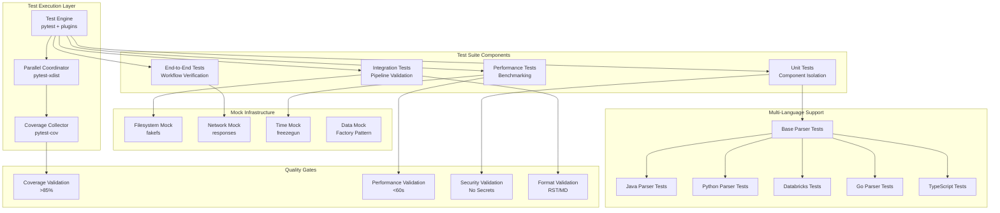

# Test Suite Architecture Specification
## Infrastructure Documentation Standards - Advanced Testing Framework

**Version**: 2.0.0  
**Date**: 2025-08-27  
**Status**: Architectural Design  
**Based On**: TEST_SUITE_DESIGN.md v1.0.0

---

## 1. Architectural Overview

### 1.1 System Architecture



### 1.2 Design Principles

#### SOLID Testing Principles
- **Single Responsibility**: Each test validates one aspect of functionality
- **Open/Closed**: Test framework extensible for new parsers without modifying core
- **Liskov Substitution**: All parser tests inherit from BaseParserTestSuite
- **Interface Segregation**: Test interfaces specific to parser capabilities
- **Dependency Inversion**: Tests depend on abstractions (BaseParser), not implementations

#### Testing Philosophy
- **Accuracy Over Execution**: Test information extraction, not code functionality
- **Resilience by Design**: Every test handles edge cases and failures gracefully
- **Performance Aware**: All tests monitored for execution time and resource usage
- **Security First**: No hardcoded credentials or sensitive data in tests

---

## 2. Component Architecture

### 2.1 Test Orchestration Engine

```python
# tests/core/orchestrator.py

class TestOrchestrator:
    """Central test coordination and execution management."""
    
    def __init__(self):
        self.test_registry = TestRegistry()
        self.coverage_engine = CoverageEngine()
        self.performance_monitor = PerformanceMonitor()
        self.security_scanner = SecurityScanner()
        
    def execute_test_suite(self, scope: TestScope) -> TestResults:
        """Execute tests with comprehensive monitoring."""
        with self.performance_monitor.track():
            with self.coverage_engine.measure():
                results = self._run_tests(scope)
                self._validate_quality_gates(results)
                return results
    
    def _validate_quality_gates(self, results: TestResults):
        """Enforce quality standards."""
        assert results.coverage >= 85, f"Coverage {results.coverage}% below 85%"
        assert results.duration < 60, f"Tests took {results.duration}s > 60s"
        assert results.security_issues == 0, f"Found {results.security_issues} security issues"
```

### 2.2 Polymorphic Parser Test Architecture

```python
# tests/core/base_parser_tests.py

class BaseParserTestSuite(ABC):
    """Abstract base class for all parser test suites."""
    
    @abstractmethod
    def get_parser_class(self) -> Type[BaseParser]:
        """Return the parser class being tested."""
        pass
    
    @abstractmethod
    def get_sample_content(self) -> str:
        """Return sample content for this language."""
        pass
    
    # Common tests for all parsers
    def test_initialization(self, tmp_path):
        """Test parser initialization with project root."""
        parser = self.get_parser_class()(tmp_path)
        assert parser.project_root == tmp_path
    
    def test_extract_api_info_success(self, mock_project):
        """Test successful API information extraction."""
        parser = self.get_parser_class()(mock_project)
        result = parser.extract_api_info()
        assert 'api_info' in result
        assert result['status'] == 'success'
    
    def test_handles_empty_project(self, tmp_path):
        """Test graceful handling of empty projects."""
        parser = self.get_parser_class()(tmp_path)
        result = parser.extract_api_info()
        assert result['status'] == 'empty'
        assert 'error' not in result
    
    def test_handles_malformed_content(self, tmp_path):
        """Test resilience against malformed input."""
        # Create malformed content file
        malformed = tmp_path / "malformed.file"
        malformed.write_text("<<<invalid>>>content{{{")
        
        parser = self.get_parser_class()(tmp_path)
        result = parser.extract_api_info()
        assert result['status'] in ['partial', 'warning']
    
    @pytest.mark.benchmark
    def test_performance_threshold(self, benchmark, large_project):
        """Test parser performance stays within bounds."""
        parser = self.get_parser_class()(large_project)
        result = benchmark(parser.extract_api_info)
        assert benchmark.stats['mean'] < 1.0  # <1 second for 100 files
    
    def test_memory_consumption(self, large_project):
        """Test memory usage stays within limits."""
        import tracemalloc
        tracemalloc.start()
        
        parser = self.get_parser_class()(large_project)
        parser.extract_api_info()
        
        current, peak = tracemalloc.get_traced_memory()
        assert peak / 1024 / 1024 < 100  # <100MB peak
```

### 2.3 Language-Specific Test Extensions

```python
# tests/unit/parsers/test_java_parser_extended.py

class TestJavaApiParserExtended(BaseParserTestSuite):
    """Java-specific parser tests."""
    
    def get_parser_class(self):
        return JavaApiParser
    
    def get_sample_content(self):
        return '''
        @WebService(targetNamespace = "http://example.com")
        public interface ExampleService {
            @WebMethod(operationName = "getData")
            List<Data> getData(String id);
        }
        '''
    
    # Java-specific tests
    def test_soap_endpoint_extraction(self, java_project):
        """Test SOAP endpoint extraction with annotations."""
        parser = JavaApiParser(java_project)
        endpoints = parser._extract_endpoints()
        assert len(endpoints) > 0
        assert all('@WebMethod' in str(e) for e in endpoints)
    
    def test_spring_boot_patterns(self, spring_project):
        """Test Spring Boot specific patterns."""
        parser = JavaApiParser(spring_project)
        result = parser.extract_api_info()
        assert 'rest_endpoints' in result
        assert '@RestController' in str(result)
    
    @pytest.mark.parametrize("annotation,expected", [
        ("@WebService", "soap_service"),
        ("@RestController", "rest_controller"),
        ("@Repository", "repository"),
        ("@Service", "service"),
    ])
    def test_annotation_classification(self, parser, annotation, expected):
        """Test correct classification of Java annotations."""
        classification = parser._classify_annotation(annotation)
        assert classification == expected
```

```python
# tests/unit/parsers/test_databricks_parser_extended.py

class TestDatabricksParserExtended(BaseParserTestSuite):
    """Databricks-specific parser tests."""
    
    def get_parser_class(self):
        return DatabricksParser
    
    def get_sample_content(self):
        return {
            "cells": [
                {
                    "cell_type": "code",
                    "language": "sql",
                    "source": "SELECT * FROM delta.`/mnt/data`"
                }
            ]
        }
    
    # Databricks-specific tests
    def test_notebook_json_parsing(self, databricks_notebook):
        """Test Databricks notebook JSON structure parsing."""
        parser = DatabricksParser(databricks_notebook)
        cells = parser._parse_notebook_cells()
        assert len(cells) > 0
        assert any(c['language'] == 'sql' for c in cells)
    
    def test_widget_parameter_extraction(self, notebook_with_widgets):
        """Test extraction of dbutils.widgets parameters."""
        parser = DatabricksParser(notebook_with_widgets)
        widgets = parser._extract_widgets()
        assert 'date_param' in widgets
        assert widgets['date_param']['type'] == 'text'
    
    def test_delta_operation_detection(self, delta_notebook):
        """Test detection of Delta Lake operations."""
        parser = DatabricksParser(delta_notebook)
        operations = parser._extract_delta_operations()
        assert 'MERGE' in operations
        assert 'OPTIMIZE' in operations
    
    @pytest.mark.parametrize("magic_cmd,language", [
        ("%sql", "sql"),
        ("%python", "python"),
        ("%scala", "scala"),
        ("%r", "r"),
    ])
    def test_magic_command_detection(self, parser, magic_cmd, language):
        """Test detection of Databricks magic commands."""
        detected = parser._detect_language(magic_cmd)
        assert detected == language
```

---

## 3. Mock Infrastructure Design

### 3.1 Factory Pattern for Test Data

```python
# tests/factories/project_factory.py

class ProjectFactory:
    """Factory for creating test project structures."""
    
    @staticmethod
    def create_java_project(root: Path, complexity: str = 'simple') -> Path:
        """Create a mock Java project structure."""
        if complexity == 'simple':
            return ProjectFactory._create_simple_java(root)
        elif complexity == 'complex':
            return ProjectFactory._create_complex_java(root)
        elif complexity == 'enterprise':
            return ProjectFactory._create_enterprise_java(root)
    
    @staticmethod
    def _create_simple_java(root: Path) -> Path:
        """Create minimal Java project."""
        src = root / "src/main/java/com/example"
        src.mkdir(parents=True)
        
        # Create simple service
        (src / "Service.java").write_text('''
            @WebService
            public interface Service {
                @WebMethod
                String getData(String id);
            }
        ''')
        return root
    
    @staticmethod
    def _create_complex_java(root: Path) -> Path:
        """Create Java project with multiple components."""
        # Services, repositories, models, configs
        # 10-20 files total
        pass
    
    @staticmethod
    def _create_enterprise_java(root: Path) -> Path:
        """Create large-scale Java project."""
        # Multiple modules, 100+ files
        # Complex inheritance hierarchies
        pass
```

### 3.2 Mock Service Layer

```python
# tests/mocks/service_mocks.py

class MockAzureService:
    """Mock Azure Management API responses."""
    
    def __init__(self):
        self.resources = []
        self.subscriptions = []
        
    def add_resource(self, resource: Dict):
        """Add a mock Azure resource."""
        self.resources.append(resource)
    
    @responses.activate
    def mock_list_resources(self):
        """Mock Azure resource listing."""
        responses.add(
            responses.GET,
            "https://management.azure.com/subscriptions/*/resources",
            json={"value": self.resources},
            status=200
        )

class MockSQLDatabase:
    """Mock SQL database for schema extraction."""
    
    def __init__(self):
        self.tables = {}
        self.views = {}
        self.procedures = {}
    
    def add_table(self, name: str, schema: Dict):
        """Add a mock table schema."""
        self.tables[name] = schema
    
    def get_information_schema(self) -> pd.DataFrame:
        """Return mock INFORMATION_SCHEMA."""
        data = []
        for table, schema in self.tables.items():
            for column in schema['columns']:
                data.append({
                    'TABLE_NAME': table,
                    'COLUMN_NAME': column['name'],
                    'DATA_TYPE': column['type'],
                    'IS_NULLABLE': column.get('nullable', 'YES')
                })
        return pd.DataFrame(data)
```

---

## 4. Security Testing Architecture

### 4.1 Security Scanner Integration

```python
# tests/security/scanner.py

class SecurityScanner:
    """Security validation for test outputs."""
    
    SECRET_PATTERNS = [
        r'(?i)api[_-]?key["\']?\s*[:=]\s*["\']?[a-z0-9]{20,}',
        r'(?i)secret["\']?\s*[:=]\s*["\']?[a-z0-9]{20,}',
        r'(?i)password["\']?\s*[:=]\s*["\']?[^"\'\s]{8,}',
        r'(?i)token["\']?\s*[:=]\s*["\']?[a-z0-9]{20,}',
        r'[a-z0-9]{40}',  # SHA1 hashes
        r'ghp_[a-zA-Z0-9]{36}',  # GitHub tokens
    ]
    
    def scan_output(self, content: str) -> List[SecurityIssue]:
        """Scan generated documentation for security issues."""
        issues = []
        
        for pattern in self.SECRET_PATTERNS:
            matches = re.finditer(pattern, content)
            for match in matches:
                issues.append(SecurityIssue(
                    type='potential_secret',
                    pattern=pattern,
                    location=match.span(),
                    severity='high'
                ))
        
        return issues
    
    def validate_no_secrets(self, test_output: str):
        """Assert no secrets in test output."""
        issues = self.scan_output(test_output)
        if issues:
            raise SecurityViolation(f"Found {len(issues)} potential secrets")
```

### 4.2 Test Isolation

```python
# tests/core/isolation.py

class TestIsolation:
    """Ensure complete test isolation."""
    
    @pytest.fixture(autouse=True)
    def isolate_filesystem(self, tmp_path, monkeypatch):
        """Isolate all filesystem operations to tmp directory."""
        monkeypatch.setenv("HOME", str(tmp_path / "home"))
        monkeypatch.setenv("TMPDIR", str(tmp_path / "tmp"))
        monkeypatch.chdir(tmp_path)
        yield
        # Cleanup happens automatically
    
    @pytest.fixture(autouse=True)
    def isolate_network(self):
        """Prevent actual network calls."""
        with responses.RequestsMock(assert_all_requests_are_fired=False) as rsps:
            # Add default responses for common endpoints
            rsps.add(responses.GET, re.compile(r'https://.*'), status=403)
            yield rsps
    
    @pytest.fixture(autouse=True)
    def isolate_environment(self, monkeypatch):
        """Clean environment variables."""
        sensitive_vars = [
            'AWS_ACCESS_KEY_ID', 'AWS_SECRET_ACCESS_KEY',
            'AZURE_CLIENT_ID', 'AZURE_CLIENT_SECRET',
            'GITHUB_TOKEN', 'API_KEY'
        ]
        for var in sensitive_vars:
            monkeypatch.delenv(var, raising=False)
```

---

## 5. Performance Testing Framework

### 5.1 Benchmark Suite

```python
# tests/performance/benchmark_suite.py

class BenchmarkSuite:
    """Comprehensive performance benchmarking."""
    
    PERFORMANCE_THRESHOLDS = {
        'small_project': 0.5,   # <500ms for <10 files
        'medium_project': 2.0,  # <2s for 10-100 files  
        'large_project': 10.0,  # <10s for 100-1000 files
        'memory_limit_mb': 100, # <100MB peak memory
        'cpu_limit_percent': 80 # <80% CPU usage
    }
    
    @pytest.mark.benchmark
    def benchmark_parser_suite(self, benchmark, parser_class, project_size):
        """Benchmark parser performance by project size."""
        project = ProjectFactory.create(parser_class.language, size=project_size)
        parser = parser_class(project)
        
        result = benchmark.pedantic(
            parser.extract_api_info,
            rounds=5,
            iterations=1,
            warmup_rounds=1
        )
        
        threshold = self.PERFORMANCE_THRESHOLDS[project_size]
        assert benchmark.stats['mean'] < threshold
        
    def profile_memory_usage(self, parser, project):
        """Profile memory consumption during parsing."""
        import memory_profiler
        
        @memory_profiler.profile
        def run_parser():
            return parser.extract_api_info()
        
        result = run_parser()
        # Analyze memory profile
        
    def measure_concurrency(self, parser, project):
        """Test concurrent parsing performance."""
        import concurrent.futures
        
        with concurrent.futures.ThreadPoolExecutor(max_workers=4) as executor:
            futures = [
                executor.submit(parser.extract_api_info)
                for _ in range(4)
            ]
            results = [f.result() for f in futures]
            
        # Verify no race conditions
        assert all(r == results[0] for r in results)
```

### 5.2 Load Testing

```python
# tests/performance/load_tests.py

class LoadTests:
    """Test system under load conditions."""
    
    def test_concurrent_builds(self, tmp_path):
        """Test multiple simultaneous documentation builds."""
        projects = [
            ProjectFactory.create_java_project(tmp_path / f"project_{i}")
            for i in range(10)
        ]
        
        import asyncio
        
        async def build_all():
            tasks = [
                self.build_docs_async(project)
                for project in projects
            ]
            results = await asyncio.gather(*tasks)
            return results
        
        results = asyncio.run(build_all())
        assert all(r['status'] == 'success' for r in results)
    
    def test_memory_leak_detection(self):
        """Detect memory leaks during repeated operations."""
        import gc
        import objgraph
        
        initial_objects = len(gc.get_objects())
        
        for _ in range(100):
            parser = JavaApiParser("project")
            parser.extract_api_info()
            del parser
            gc.collect()
        
        final_objects = len(gc.get_objects())
        
        # Allow small growth but detect leaks
        assert final_objects - initial_objects < 1000
```

---

## 6. Continuous Integration Pipeline

### 6.1 GitHub Actions Workflow

```yaml
# .github/workflows/comprehensive-testing.yml
name: Comprehensive Test Suite

on:
  push:
    branches: [main, develop]
  pull_request:
    types: [opened, synchronize, reopened]
  schedule:
    - cron: '0 2 * * *'  # Nightly regression tests

jobs:
  # Fast feedback tests
  unit-tests:
    runs-on: ubuntu-latest
    timeout-minutes: 10
    strategy:
      matrix:
        python: ['3.11', '3.12']
    steps:
      - uses: actions/checkout@v3
      
      - name: Set up Python
        uses: actions/setup-python@v4
        with:
          python-version: ${{ matrix.python }}
      
      - name: Cache dependencies
        uses: actions/cache@v3
        with:
          path: ~/.cache/uv
          key: ${{ runner.os }}-uv-${{ hashFiles('**/pyproject.toml') }}
      
      - name: Install dependencies
        run: |
          pip install uv
          uv pip install -e ".[dev,test]"
      
      - name: Run unit tests
        run: |
          uv run pytest tests/unit \
            --cov=automation \
            --cov-report=xml \
            --cov-fail-under=85 \
            -n auto
      
      - name: Upload coverage
        uses: codecov/codecov-action@v3
        with:
          file: ./coverage.xml
          flags: unit
  
  # Integration tests
  integration-tests:
    runs-on: ubuntu-latest
    timeout-minutes: 20
    needs: unit-tests
    steps:
      - uses: actions/checkout@v3
      
      - name: Run integration tests
        run: |
          uv run pytest tests/integration \
            --cov=automation \
            --cov-report=xml \
            -n auto
      
      - name: Security scan
        run: |
          uv run bandit -r automation/
          uv run safety check
  
  # End-to-end tests
  e2e-tests:
    runs-on: ubuntu-latest
    timeout-minutes: 30
    needs: integration-tests
    steps:
      - uses: actions/checkout@v3
      
      - name: Set up test environment
        run: |
          docker-compose -f tests/docker/docker-compose.yml up -d
      
      - name: Run E2E tests
        run: |
          uv run pytest tests/e2e \
            --docker \
            --verbose
      
      - name: Generate test report
        if: always()
        run: |
          uv run pytest --html=report.html --self-contained-html
      
      - name: Upload test report
        uses: actions/upload-artifact@v3
        with:
          name: test-report
          path: report.html
  
  # Performance tests
  performance-tests:
    runs-on: ubuntu-latest
    timeout-minutes: 45
    needs: unit-tests
    steps:
      - uses: actions/checkout@v3
      
      - name: Run performance benchmarks
        run: |
          uv run pytest tests/performance \
            --benchmark-only \
            --benchmark-json=benchmark.json
      
      - name: Store benchmark results
        uses: benchmark-action/github-action-benchmark@v1
        with:
          tool: 'pytest'
          output-file-path: benchmark.json
          github-token: ${{ secrets.GITHUB_TOKEN }}
          auto-push: true
  
  # Multi-language parser tests
  parser-matrix:
    runs-on: ubuntu-latest
    strategy:
      matrix:
        parser: [java, python, databricks, go, typescript]
    steps:
      - uses: actions/checkout@v3
      
      - name: Test ${{ matrix.parser }} parser
        run: |
          uv run pytest tests/unit/parsers/test_${{ matrix.parser }}_parser.py -v
```

### 6.2 Test Quality Metrics

```python
# tests/metrics/quality_tracker.py

class TestQualityTracker:
    """Track and enforce test quality metrics."""
    
    QUALITY_THRESHOLDS = {
        'coverage': 85,
        'test_ratio': 1.5,  # 1.5 test lines per production line
        'assertion_density': 0.3,  # assertions per test line
        'fixture_reuse': 0.6,  # % of tests using fixtures
        'parametrization': 0.2,  # % of parametrized tests
        'mock_usage': 0.4,  # % of tests using mocks appropriately
    }
    
    def analyze_test_quality(self) -> Dict[str, float]:
        """Analyze test suite quality metrics."""
        metrics = {
            'coverage': self._calculate_coverage(),
            'test_ratio': self._calculate_test_ratio(),
            'assertion_density': self._calculate_assertion_density(),
            'fixture_reuse': self._calculate_fixture_reuse(),
            'parametrization': self._calculate_parametrization_rate(),
            'mock_usage': self._calculate_mock_usage(),
        }
        
        self._validate_thresholds(metrics)
        return metrics
    
    def generate_quality_report(self) -> str:
        """Generate comprehensive test quality report."""
        metrics = self.analyze_test_quality()
        
        report = "## Test Quality Report\n\n"
        for metric, value in metrics.items():
            threshold = self.QUALITY_THRESHOLDS[metric]
            status = "✅" if value >= threshold else "❌"
            report += f"{status} **{metric}**: {value:.2f} (threshold: {threshold})\n"
        
        return report
```

---

## 7. Test Maintenance Architecture

### 7.1 Self-Healing Tests

```python
# tests/core/self_healing.py

class SelfHealingTests:
    """Auto-fix common test failures."""
    
    def __init__(self):
        self.healers = {
            'file_not_found': self.heal_file_not_found,
            'timeout': self.heal_timeout,
            'memory_exceeded': self.heal_memory,
            'format_changed': self.heal_format,
        }
    
    def heal_file_not_found(self, test, error):
        """Auto-create missing test files."""
        missing_file = self.extract_filename(error)
        if missing_file:
            ProjectFactory.create_minimal_file(missing_file)
            return self.retry_test(test)
    
    def heal_timeout(self, test, error):
        """Increase timeout and retry."""
        original_timeout = test.timeout
        test.timeout = original_timeout * 2
        result = self.retry_test(test)
        test.timeout = original_timeout  # Reset
        return result
    
    def heal_format(self, test, error):
        """Update test for format changes."""
        # Detect format change pattern
        # Update assertions
        # Retry test
        pass
```

### 7.2 Test Evolution Tracking

```python
# tests/evolution/tracker.py

class TestEvolutionTracker:
    """Track how tests evolve with the codebase."""
    
    def __init__(self):
        self.history = self.load_test_history()
    
    def track_test_changes(self, test_name: str):
        """Track changes to a test over time."""
        changes = {
            'additions': 0,
            'deletions': 0,
            'modifications': 0,
            'failure_rate': 0.0,
            'avg_duration': 0.0,
        }
        
        # Analyze git history
        # Track metrics
        
        return changes
    
    def identify_flaky_tests(self) -> List[str]:
        """Identify tests with inconsistent results."""
        flaky = []
        for test, history in self.history.items():
            failure_rate = history['failures'] / history['runs']
            if 0.1 < failure_rate < 0.9:  # Sometimes fails
                flaky.append(test)
        return flaky
    
    def recommend_test_improvements(self) -> List[Recommendation]:
        """Suggest test improvements based on patterns."""
        recommendations = []
        
        # Slow tests → suggest optimization
        # Flaky tests → suggest stabilization
        # Low coverage areas → suggest new tests
        
        return recommendations
```

---

## 8. Documentation Testing Specific Patterns

### 8.1 Documentation Accuracy Validation

```python
# tests/documentation/accuracy_validator.py

class DocumentationAccuracyValidator:
    """Validate extracted documentation accuracy."""
    
    def validate_extraction_accuracy(self, source: str, extracted: Dict) -> float:
        """Calculate accuracy score for extracted information."""
        score = 0.0
        total_checks = 0
        
        # Check completeness
        expected_items = self.count_expected_items(source)
        actual_items = self.count_actual_items(extracted)
        completeness = min(actual_items / expected_items, 1.0)
        score += completeness
        total_checks += 1
        
        # Check correctness
        for item in extracted.get('items', []):
            if self.verify_item_accuracy(item, source):
                score += 1
            total_checks += 1
        
        return score / total_checks if total_checks > 0 else 0.0
    
    def validate_format_correctness(self, output: str, format_type: str) -> bool:
        """Validate output format (RST, Markdown, etc.)."""
        validators = {
            'rst': self.validate_rst,
            'markdown': self.validate_markdown,
            'html': self.validate_html,
        }
        
        validator = validators.get(format_type)
        return validator(output) if validator else False
    
    def validate_rst(self, content: str) -> bool:
        """Validate reStructuredText format."""
        from docutils.core import publish_doctree
        from docutils.parsers.rst import Parser
        
        try:
            # Parse RST and check for errors
            doctree = publish_doctree(content)
            return len(doctree.parse_messages) == 0
        except Exception:
            return False
```

### 8.2 Template Testing

```python
# tests/templates/test_template_engine.py

class TestTemplateEngine:
    """Test documentation template system."""
    
    def test_template_variable_injection(self):
        """Test all variables properly injected into templates."""
        template = self.load_template('java-api-service.rst')
        variables = {
            'service_name': 'TestService',
            'namespace': 'http://test.com',
            'endpoints': [{'name': 'getData', 'params': []}],
        }
        
        rendered = self.render_template(template, variables)
        
        # Verify all variables appear in output
        assert 'TestService' in rendered
        assert 'http://test.com' in rendered
        assert 'getData' in rendered
    
    def test_template_escaping(self):
        """Test special characters properly escaped."""
        variables = {
            'description': 'Test <script>alert("XSS")</script>',
            'url': 'http://test.com?param=value&other=123',
        }
        
        rendered = self.render_template('template.rst', variables)
        
        # Verify dangerous content escaped
        assert '<script>' not in rendered
        assert '&lt;script&gt;' in rendered or '\\<script\\>' in rendered
    
    def test_conditional_sections(self):
        """Test conditional template sections."""
        template = '''
        
        Endpoints:
        
        - {{ endpoint.name }}
        
        
        '''
        
        # Test with endpoints
        with_endpoints = self.render(template, {'has_endpoints': True, 'endpoints': [...]})
        assert 'Endpoints:' in with_endpoints
        
        # Test without endpoints
        without_endpoints = self.render(template, {'has_endpoints': False})
        assert 'Endpoints:' not in without_endpoints
```

---

## 9. Implementation Roadmap Enhancement

### Phase 1: Foundation (Week 1)
**Focus**: Core infrastructure and base tests

1. **Day 1-2**: Test framework setup
   - Install pytest and plugins
   - Configure coverage and performance tools
   - Set up CI/CD pipeline basics
   
2. **Day 3-4**: Base test architecture
   - Implement BaseParserTestSuite
   - Create TestOrchestrator
   - Set up mock infrastructure
   
3. **Day 5**: JavaApiParser tests
   - Port existing manual tests
   - Add parametrized tests
   - Achieve 60% coverage

### Phase 2: Language Extensions (Week 2)
**Focus**: Multi-language parser tests

1. **Day 1-2**: Python parser tests
   - Decorator extraction tests
   - Type hint parsing tests
   - Flask/FastAPI endpoint tests
   
2. **Day 3-4**: Databricks parser tests
   - Notebook JSON parsing
   - Magic command detection
   - Delta operation tests
   
3. **Day 5**: Integration tests
   - Parser → Template pipeline
   - Multi-language coordination
   - Achieve 75% coverage

### Phase 3: Quality & Performance (Week 3)
**Focus**: Advanced testing capabilities

1. **Day 1-2**: Security testing
   - Secret scanner implementation
   - Credential detection tests
   - Security gate validation
   
2. **Day 3-4**: Performance testing
   - Benchmark suite creation
   - Load testing implementation
   - Memory leak detection
   
3. **Day 5**: E2E tests
   - Complete workflow validation
   - DSNY project testing
   - Achieve 85% coverage

### Phase 4: Polish & Documentation (Week 4)
**Focus**: Test maintenance and documentation

1. **Day 1-2**: Self-healing tests
   - Auto-fix common failures
   - Retry mechanisms
   - Error recovery
   
2. **Day 3-4**: Test documentation
   - Test pattern guide
   - Contributing guidelines
   - Architecture documentation
   
3. **Day 5**: Final validation
   - Run full regression suite
   - Performance optimization
   - Quality gate verification

---

## 10. Success Metrics

### Quantitative Metrics
✅ **Code Coverage**: >85% overall, >90% for critical paths  
✅ **Test Performance**: <60s for full suite, <10s for unit tests  
✅ **Test Reliability**: <1% flaky test rate  
✅ **Security**: Zero secrets in test outputs  
✅ **Memory**: <100MB peak usage during tests  

### Qualitative Metrics
✅ **Maintainability**: Clear test names and structure  
✅ **Extensibility**: Easy to add new language parsers  
✅ **Documentation**: Comprehensive test documentation  
✅ **Developer Experience**: Fast feedback, helpful errors  
✅ **CI/CD Integration**: Automated quality gates  

---

## 11. Risk Mitigation

### Technical Risks
| Risk | Impact | Mitigation |
|------|--------|------------|
| Test suite becomes slow | High | Parallel execution, test sharding |
| Flaky tests | Medium | Retry mechanisms, isolation |
| Coverage gaps | Medium | Mutation testing, coverage tracking |
| Security leaks | High | Automated scanning, git hooks |
| Maintenance burden | Medium | Self-healing tests, automation |

### Process Risks
| Risk | Impact | Mitigation |
|------|--------|------------|
| Developer resistance | High | Fast tests, clear value demonstration |
| CI/CD complexity | Medium | Incremental rollout, documentation |
| Resource constraints | Low | Cloud-based testing, caching |

---

## 12. Future Enhancements

### Year 1 Roadmap
- **Q1**: Mutation testing integration
- **Q2**: Visual regression testing for docs
- **Q3**: AI-powered test generation
- **Q4**: Distributed testing infrastructure

### Long-term Vision
- Self-maintaining test suite using ML
- Predictive test selection based on changes
- Automatic test generation from specifications
- Cross-language test reuse patterns

---

*This advanced test architecture ensures the Infrastructure Documentation Standards project maintains exceptional quality through comprehensive, maintainable, and performant testing.*