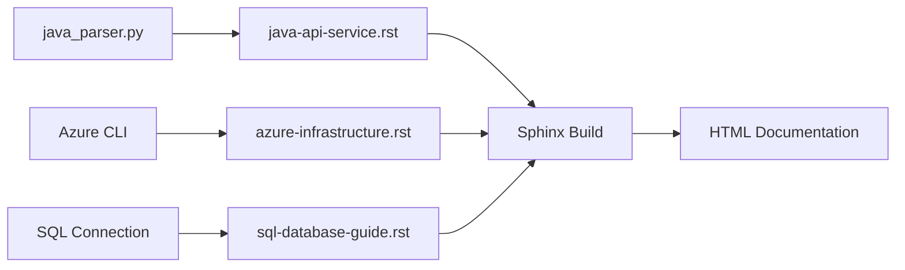

# Project Navigation Guide

## 🗺️ Quick Navigation Map

### For New Users
1. Start with [`PROJECT_INDEX.md`](PROJECT_INDEX.md) - Complete project overview
2. Review [`CLAUDE.md`](CLAUDE.md) - Project-specific AI instructions
3. Check [`pyproject.toml`](pyproject.toml) - Available commands

### For Developers
1. [`/automation/`](automation/) - Core automation scripts
   - [`build.py`](automation/build.py) - Sphinx build system
   - [`java_parser.py`](automation/java_parser.py) - API extraction
2. [`/docs/source/_templates/`](docs/source/_templates/) - Documentation templates
3. [`/docs/source/conf.py`](docs/source/conf.py) - Sphinx configuration

### For Documentation Writers
1. [`/docs/source/_templates/`](docs/source/_templates/) - Reusable templates
2. [`/docs/source/examples/`](docs/source/examples/) - Working examples
3. [`/docs/source/index.rst`](docs/source/index.rst) - Main documentation entry

---

## 📁 Directory Cross-Reference

```
infrastructure-documentation-standards/
│
├── 📦 automation/                    → Automation Scripts
│   ├── build.py                     → Build system [See: Quick Start Commands]
│   ├── java_parser.py               → Java API extractor [See: Production Example]
│   └── setup.py                     → Project setup
│
├── 📚 docs/
│   └── source/
│       ├── _templates/              → Documentation Templates
│       │   ├── java-api-service.rst → API documentation [Used by: java_parser.py]
│       │   ├── azure-infrastructure.rst → Azure docs [Pending implementation]
│       │   └── sql-database-guide.rst → SQL docs [Pending implementation]
│       │
│       ├── _extensions/             → Custom Sphinx Directives
│       │                            → [Future: azure-inventory, sql-schema]
│       │
│       ├── examples/                → Working Examples
│       │   └── sample-project/     → Complete production integration
│       │                           → [See: Success Metrics]
│       │
│       ├── infrastructure/          → Infrastructure Docs
│       ├── data-engineering/        → Data Pipeline Docs
│       └── operations/              → Operational Guides
│
├── 📋 Configuration Files
│   ├── pyproject.toml              → Package & command definitions
│   ├── CLAUDE.md                   → AI assistant instructions
│   └── PROJECT_SPECIFICATION.md    → Original requirements
│
└── 📝 Documentation
    ├── PROJECT_INDEX.md            → This comprehensive index
    ├── NAVIGATION.md                → This navigation guide
    ├── README.md                    → Basic project readme
    └── sphinx-intro.md              → Sphinx introduction

```

---

## 🔗 Key Relationships

### Command → Script → Template Flow

| Command | Script | Template | Output |
|---------|--------|----------|--------|
| `docs-build` | `automation/build.py` | All templates | HTML docs |
| `java-docs` | `automation/java_parser.py` | `java-api-service.rst` | API documentation |
| `azure-docs` | *Planned* | `azure-infrastructure.rst` | Azure inventory |
| `sql-docs` | *Planned* | `sql-database-guide.rst` | Schema docs |

### Template Dependencies



---

## 🎯 Task-Based Navigation

### "I want to document a Java API"
1. Use [`automation/java_parser.py`](automation/java_parser.py)
2. Template: [`docs/source/_templates/java-api-service.rst`](docs/source/_templates/java-api-service.rst)
3. Example: [`docs/source/examples/sample-project/`](docs/source/examples/sample-project/)
4. Command: `uv run java-docs`

### "I want to build the documentation"
1. Script: [`automation/build.py`](automation/build.py)
2. Config: [`docs/source/conf.py`](docs/source/conf.py)
3. Command: `uv run docs-build`

### "I want to add a new automation"
1. Create script in [`automation/`](automation/)
2. Add command to [`pyproject.toml`](pyproject.toml)
3. Create template in [`docs/source/_templates/`](docs/source/_templates/)

### "I want to see a working example"
1. Sample Project: [`docs/source/examples/sample-project/`](docs/source/examples/sample-project/)
2. Generated Docs: [`reports-utilization-api-docs.rst`](docs/source/examples/reports-utilization-api-docs.rst)

---

## 📊 Component Status Dashboard

| Component | Status | Location | Notes |
|-----------|--------|----------|-------|
| Build System | ✅ Complete | `automation/build.py` | Using Context7 patterns |
| Java Parser | ✅ Complete | `automation/java_parser.py` | Proven in production |
| Azure Integration | 🔄 Planned | `automation/azure.py` | Next priority |
| SQL Integration | 🔄 Planned | `automation/sql.py` | Dependency: pyodbc |
| IT Glue Deploy | 🔄 Planned | `automation/deploy.py` | API integration needed |
| Templates | ✅ Foundation | `docs/source/_templates/` | 4 templates ready |
| Production Example | ✅ Complete | `docs/source/examples/sample-project/` | 7 endpoints documented |

---

## 🔍 Search Patterns

### Find by Technology
- **Java/SOAP**: `java_parser.py`, `java-api-service.rst`, `sample-project/`
- **Azure**: `azure-infrastructure.rst`, `azure-docs` command
- **SQL**: `sql-database-guide.rst`, `sql-docs` command
- **Sphinx**: `build.py`, `conf.py`, `index.rst`

### Find by Purpose
- **Automation**: `/automation/*.py`
- **Templates**: `/docs/source/_templates/*.rst`
- **Examples**: `/docs/source/examples/`
- **Configuration**: `pyproject.toml`, `conf.py`

### Find by Workflow Stage
- **Setup**: `setup.py`, `pyproject.toml`
- **Development**: `java_parser.py`, templates
- **Building**: `build.py`, `docs-build`
- **Deployment**: `deploy.py`, `deploy-itglue`

---

## 💡 Pro Tips

1. **Start with Examples**: The sample project in `examples/sample-project/` shows the complete workflow
2. **Use Templates**: Don't create documentation from scratch - modify existing templates
3. **Check Commands**: Run `uv run --help` to see all available automation commands
4. **Session Memory**: Project context is preserved in Serena MCP memories
5. **Parallel Builds**: The build system uses parallel processing for speed

---

*Navigation Guide Version 1.0*  
*Use PROJECT_INDEX.md for detailed component information*